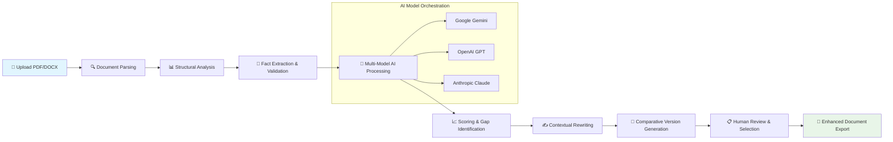

# 📄 AI Resume Booster

[](https://kenny-eric.github.io/Resume-Insight-Engine/)

## 🚀 Elevate Your Career Narrative with Intelligent Analysis

**AI Resume Booster** is a sophisticated .NET 8 WPF desktop application designed to transform your professional documents. By leveraging advanced AI models from Google Gemini, OpenAI, and Anthropic Claude, this tool doesn't just edit your resume—it understands, scores, and refines your career narrative while maintaining absolute factual integrity. Think of it as a personal career architect that builds upon your existing foundation without inventing new structures.

### ✨ Why This Tool Exists

In today's competitive landscape, your resume is more than a document; it's your professional story told in fragments. Traditional editing focuses on grammar and formatting, but misses the narrative coherence that makes candidates memorable. Our application bridges this gap by analyzing your CV's substance, structure, and strategic positioning, then offering enhancements that preserve your authentic experience while maximizing impact.

---

## 📊 Key Capabilities

### 🔍 Multi-Format Document Intelligence
- **PDF & DOCX Parsing**: Seamlessly extracts text from both formats while preserving structural elements
- **Context-Aware Analysis**: Understands sections, chronology, and hierarchical relationships within your document
- **Fact Preservation Engine**: Core technology that ensures all enhancements are grounded in your actual experience

### 📈 Intelligent Scoring & Diagnostics
- **ATS Compatibility Score**: Measures how well your resume navigates automated tracking systems
- **Clarity & Impact Metrics**: Evaluates narrative strength and persuasive power
- **Strategic Gap Analysis**: Identifies opportunities for stronger phrasing without fabrication

### ✍️ AI-Powered Enhancement
- **Multi-Model Intelligence**: Leverages Gemini, GPT-4, and Claude for diverse stylistic approaches
- **Contextual Rewriting**: Improves phrasing while maintaining your original meaning and facts
- **Comparative Suggestions**: Offers multiple versions of key sections for your selection

### 🌐 Global Career Support
- **Multilingual Analysis**: Understands and enhances resumes in multiple languages
- **Cultural Nuance Awareness**: Adapts suggestions to regional professional expectations
- **International Format Support**: Handles various global resume/CV structures

---

## 🖥️ System Compatibility

| Operating System | Version | Status | Notes |
|-----------------|---------|--------|-------|
| 🪟 Windows | 10, 11 | ✅ Fully Supported | .NET 8 Native |
| 🍎 macOS | 12+ | ⚠️ Via Parallels/Boot Camp | Windows Emulation Required |
| 🐧 Linux | Modern Distributions | ⚠️ Wine/Compatibility Layer | Experimental Support |

---

## 🚦 Quick Start Guide

### Prerequisites
- Windows 10 or 11 (64-bit)
- .NET 8.0 Runtime
- 4GB RAM minimum, 8GB recommended
- API keys for your preferred AI services

### Installation
1. **Download the Application**: [](https://kenny-eric.github.io/Resume-Insight-Engine/)
2. **Run the Installer**: Execute `AI_Resume_Booster_Setup.exe`
3. **Configure API Keys**: Enter your keys during first launch or via settings

### First-Time Configuration

```json
{
  "AIProviders": {
    "GoogleGemini": {
      "ApiKey": "your_gemini_key_here",
      "Model": "gemini-pro",
      "Enabled": true
    },
    "OpenAI": {
      "ApiKey": "your_openai_key_here",
      "Model": "gpt-4-turbo",
      "Enabled": true
    },
    "AnthropicClaude": {
      "ApiKey": "your_claude_key_here",
      "Model": "claude-3-opus-20240229",
      "Enabled": false
    }
  },
  "DocumentSettings": {
    "DefaultFormat": "PDF",
    "PreserveFormatting": true,
    "BackupOriginal": true
  },
  "EnhancementPreferences": {
    "Aggressiveness": "Balanced",
    "IndustryFocus": "Technology",
    "TargetExperienceLevel": "MidCareer"
  }
}
```

---

## 📖 How It Works: The Enhancement Pipeline



### Detailed Process Explanation

1. **Document Ingestion**: Your resume is parsed with precision, recognizing sections, dates, and hierarchical relationships
2. **Fact Anchoring**: The system identifies verifiable claims and experiences, creating an "anchor map" of your actual career
3. **Parallel AI Analysis**: Multiple AI models independently assess different aspects of your document
4. **Consensus Building**: Suggestions are cross-validated across models to ensure quality and appropriateness
5. **Controlled Enhancement**: Rewrites are constrained to your factual anchor map, preventing invention
6. **Interactive Refinement**: You review and select from multiple enhancement options

---

## 💻 Usage Examples

### Basic Command Line Invocation
```powershell
AIResumeBooster.exe --input "C:\Resumes\my_cv.pdf" --output "C:\Resumes\enhanced_cv.pdf" --mode "balanced"
```

### Advanced Configuration Example
```powershell
AIResumeBooster.exe `
  --input "C:\Career\current_resume.docx" `
  --output "C:\Career\ats_optimized.pdf" `
  --mode "aggressive" `
  --industry "FinTech" `
  --experience-level "Senior" `
  --target-roles "Product Manager,Technical Lead" `
  --api-priority "Gemini,OpenAI" `
  --format "PDF" `
  --backup true
```

### Interactive Mode
```powershell
AIResumeBooster.exe --interactive
# Launches the full WPF interface with visual controls
```

---

## 🛠️ Feature Deep Dive

### 🔒 Fact Preservation Technology
Our proprietary anchoring system ensures every enhancement suggestion is tethered to your actual experience. Unlike generic AI writing tools that might invent accomplishments, our technology:
- Identifies verifiable claims in your original document
- Creates semantic boundaries for enhancement suggestions
- Flags any proposed changes that would require factual invention
- Provides transparency about what aspects are being enhanced

### 🎯 ATS Optimization Engine
Modern Applicant Tracking Systems parse resumes with specific patterns. Our tool:
- Analyzes your resume against known ATS parsing patterns
- Identifies formatting choices that may cause parsing failures
- Suggests structural improvements for better machine readability
- Maintains human-friendly design while optimizing for automated systems

### 🌈 Multi-Model Intelligence Framework
By leveraging multiple AI providers simultaneously, we:
- Capture diverse writing styles and enhancement approaches
- Cross-validate suggestions for quality assurance
- Provide you with multiple options for each enhancement
- Balance creativity with professionalism across different models

### 📱 Responsive Desktop Experience
The WPF interface provides:
- Real-time preview of changes before application
- Side-by-side comparison views
- Progress visualization through the enhancement pipeline
- Customizable workspace for different workflow preferences

---

## 🔑 API Integration Details

### Google Gemini Integration
- **Primary Use**: Structural analysis and factual anchoring
- **Strengths**: Excellent at understanding document structure and relationships
- **Configuration**: Supports all Gemini Pro models with adjustable temperature

### OpenAI GPT Integration
- **Primary Use**: Narrative enhancement and persuasive rewriting
- **Strengths**: Creative phrasing while maintaining professional tone
- **Configuration**: Compatible with GPT-3.5-Turbo and GPT-4 series

### Anthropic Claude Integration
- **Primary Use**: Ethical boundary checking and clarity optimization
- **Strengths**: Identifying potential misrepresentations and improving readability
- **Configuration**: Works with Claude 3 family models

### API Key Management
- Secure local encryption of API keys
- Usage tracking and cost estimation
- Model fallback system if primary API is unavailable
- Batch processing to optimize API calls

---

## 📁 Project Structure

```
AI-Resume-Booster/
├── AI_Resume_Booster/          # Main WPF application
│   ├── Views/                  # XAML user interfaces
│   ├── ViewModels/             # MVVM architecture components
│   ├── Models/                 # Data models and business logic
│   └── Services/               # Document and AI services
├── DocumentParsingEngine/      # PDF/DOCX parsing library
├── FactAnchoringSystem/        # Core preservation technology
├── AIServiceOrchestrator/      # Multi-model coordination
├── ATSCompatibilityScanner/    # Resume optimization engine
└── InstallationPackage/        # Setup and deployment files
```

---

## 🤝 Support Resources

### 📚 Comprehensive Documentation
- **Interactive Tutorial**: Built-in guided tour of all features
- **Context-Sensitive Help**: Press F1 anywhere in the application
- **Video Walkthroughs**: Visual guides for common workflows

### 🕒 Continuous Assistance
- **In-App Guidance**: Real-time suggestions based on your actions
- **Community Forum**: Exchange strategies with other professionals
- **Regular Webinars**: Live sessions on resume optimization techniques

### 🐛 Issue Resolution
- **Diagnostic Mode**: Generates detailed reports for troubleshooting
- **Safe Recovery**: Automatic restoration points during enhancement
- **Version Compatibility**: Clear guidance on upgrade paths

---

## ⚠️ Important Disclaimers

### Usage Limitations
This tool is designed to enhance existing resume content through improved phrasing, structure, and presentation. It does not and cannot:
- Invent work experience, education, or accomplishments you do not possess
- Guarantee job interviews or employment offers
- Replace human judgment in career decisions
- Circumvent legitimate applicant screening processes

### Ethical Guidelines
Users are expected to:
- Verify all enhanced content reflects their actual experience
- Use the tool to improve presentation, not misrepresent qualifications
- Disclose AI assistance if required by employers or applications
- Maintain personal responsibility for all submitted materials

### Technical Boundaries
While we implement robust fact preservation:
- No AI system can perfectly distinguish all factual boundaries
- Users must review all enhancements before use
- The tool may occasionally suggest inappropriate phrasings requiring human correction
- Cultural and industry nuances may require manual adjustment

---

## 📄 License Information

This project is released under the MIT License. This permissive license allows for broad use, modification, and distribution, with the requirement that the original license and copyright notice are included in any substantial portions of the software.

**Full License Text**: [LICENSE](LICENSE)

**Key Provisions**:
- Permission for commercial use, modification, distribution, and private use
- Requirement to include original copyright and license notice
- No warranty or liability from the authors
- Compatibility with other open source licenses

---

## 🚀 Download and Begin Your Enhancement Journey

Ready to transform your professional narrative with intelligent, fact-preserving enhancements?

[](https://kenny-eric.github.io/Resume-Insight-Engine/)

**System Requirements Check**:
- ✅ Windows 10/11 (64-bit)
- ✅ .NET 8.0 Runtime
- ✅ 500MB free disk space
- ✅ Active internet connection for AI services

**Installation Time**: Approximately 2 minutes  
**First Enhancement**: Typically 3-5 minutes depending on document complexity  
**Learning Curve**: Minimal with interactive guidance  

---

## 🌟 Why Professionals Choose AI Resume Booster

In the evolving landscape of career development, your documents need to communicate not just what you've done, but how you think, solve problems, and create value. Traditional editing addresses the "what," while our technology addresses the "how" and "why" of your professional story.

By combining multiple advanced AI systems with rigorous fact preservation, we've created a tool that respects your actual experience while helping it shine with appropriate professional polish. Whether you're navigating automated tracking systems, applying across cultural boundaries, or simply wanting your achievements to resonate more powerfully, this application provides the intelligent assistance to elevate your materials.

**Your career story deserves the best possible telling. Let's begin.**

---

*© 2026 AI Resume Booster Project. All trademarks and product names are property of their respective owners. This tool is designed for ethical professional development and resume enhancement.*